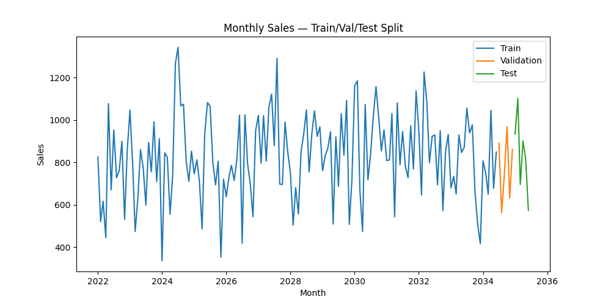
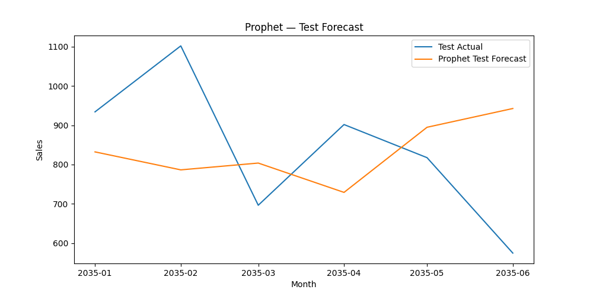
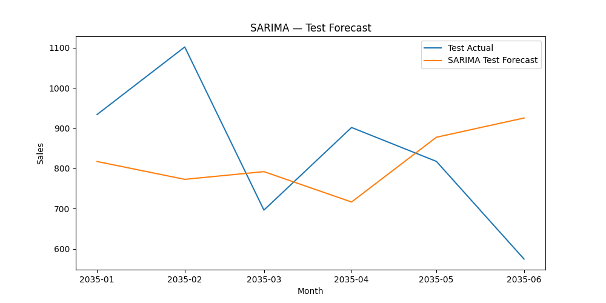
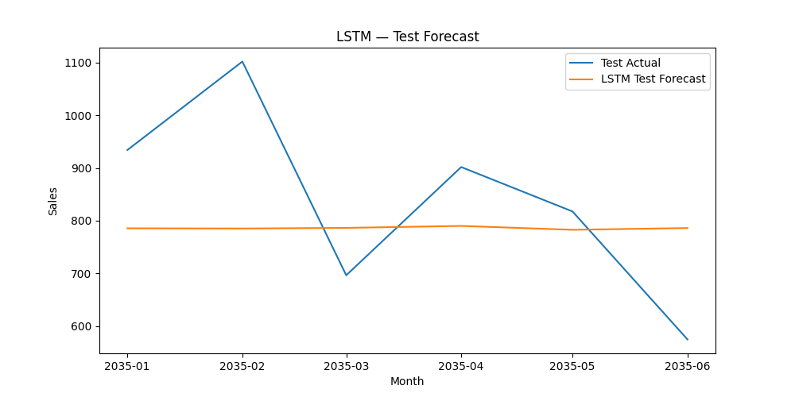
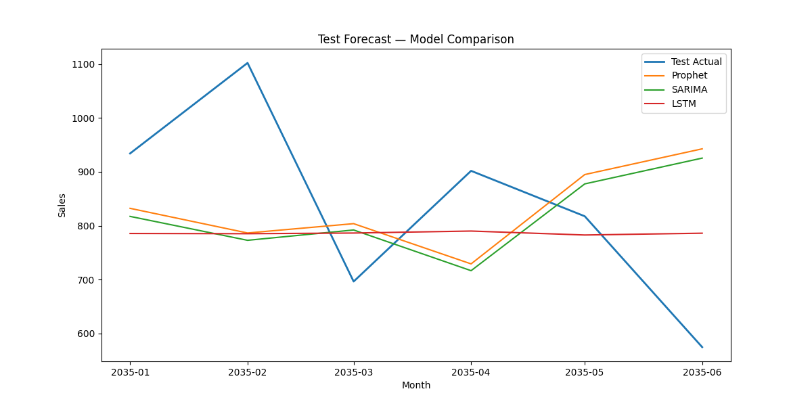

# Monthly Sales Forecasting Project

## 📌 Overview
This project forecasts **monthly sales** using the Kaggle **Demand Forecasting Dataset**.  
It leverages three different approaches:  
- **Prophet** (trend + seasonality modeling)  
- **ARIMA (SARIMA)** (classical time-series)  
- **LSTM** (deep learning for sequential patterns)  

The notebook performs **data preprocessing, model training, evaluation, and visualization** to help businesses predict upcoming sales and plan inventory, demand, and resources accordingly.

---

## ✨ Features
- **Data Preparation**: Aggregates daily sales into monthly totals.  
- **Models Implemented**: Prophet, ARIMA (SARIMA), and LSTM.  
- **Performance Evaluation**: RMSE, MAE, MAPE metrics.  
- **Visualizations**: Actual vs Forecast plots for Train, Validation, and Test sets.  
- **Comparison Leaderboard**: Ranks models based on test performance.  

---

## ⚙️ Installation
1. Clone the repository:
   ```bash
   git clone https://github.com/your-username/Monthly_Sales_Forecasting.git
   cd Monthly_Sales_Forecasting
   ```
2. Install dependencies:
   ```bash
   pip install pandas numpy matplotlib scikit-learn statsmodels prophet tensorflow
   ```

---

## 🚀 Usage
Run the Jupyter Notebook to perform the forecasting:
```bash
jupyter notebook Monthly_Sales_Forecasting_Prophet_ARIMA_LSTM.ipynb
```

**Dataset:**  
Download the Kaggle [Demand Forecasting Dataset](https://www.kaggle.com/competitions/demand-forecasting-kernels-only/data)  
and place `train.csv` in the project folder.  

---

## 📊 Example Outputs

### 1. Train/Validation/Test Split


### 2. Prophet Test Forecast


### 3. SARIMA Test Forecast


### 4. LSTM Test Forecast


### 5. Model Comparison (Test Period)


---

## 📌 Future Enhancements
- Add holiday/festival effects in Prophet.  
- Forecast per store/per item.  
- Incorporate external features (weather, promotions).  
- Extend to a Streamlit/Dash interactive dashboard.  
